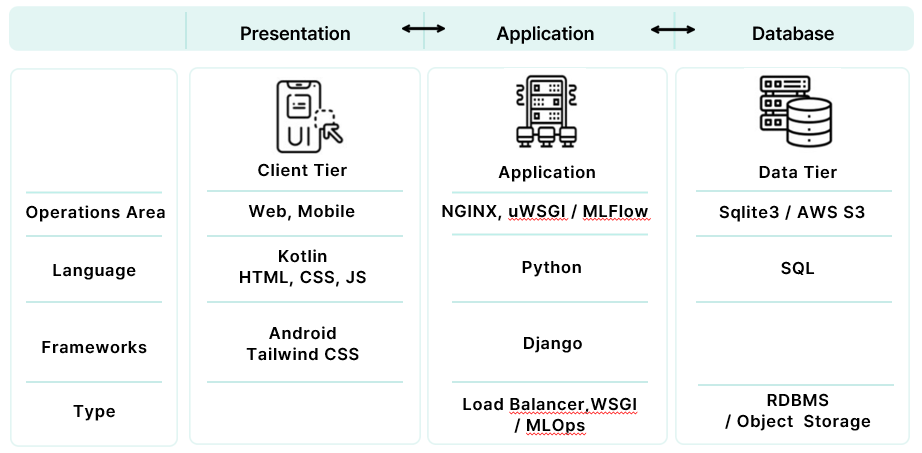
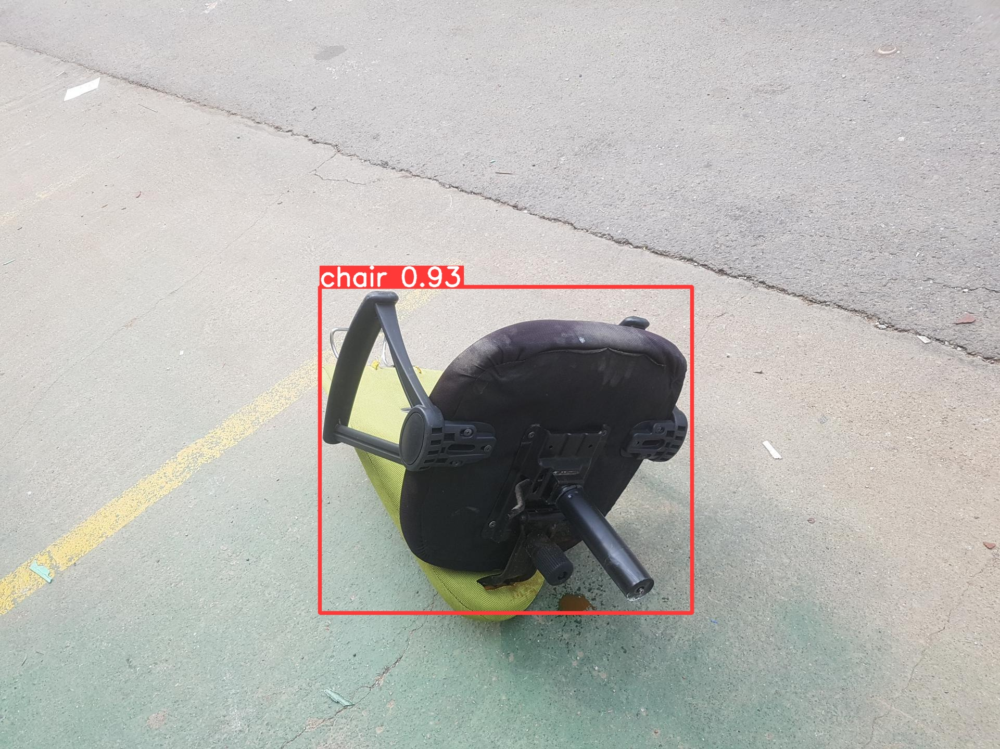

# AI 기반 대형폐기물 간편 배출 서비스 앱 'Funi Buni'

## 📢 팀원 소개
<table>
  <tbody>

     
  </tbody>
</table>

 

## 🐇 프로젝트 소개

⬆️ 위 이미지를 클릭하면 퍼니버니 홈페이지로 이동합니다 ⬆️
 

> - 프로젝트 명: AI 기반 대형폐기물 간편 배출 서비스 앱 'Funi Buni'
> - 프로젝트 기간: 2023.05.31 ~ 2023.07.11
> - 프로젝트 인원: 6명 (AI/MLOps/FE 4명, Android 1명, BE 1명)

 

우리는 대형폐기물을 버리기 위해서 구청에 배출을 신청하고 구청에서 발급해주는 스티커를 직접 구매해야 합니다.
현재 대면 배출신청의 불편함을 덜기 위해 인터넷 및 어플 배출신청 등의 서비스가 제공 되고는 있지만 **수많은 배출품목**, **지역구마다 다른 스티커 가격표**는 한눈에 보기 어려워 여전히 불편함을 줍니다.  
이러한 문제를 해결하기 위해 AI 모델을 통해 **사진 한 장으로 어떤 품목인지 즉시 분류**해주고 **가격제시, 배출신청까지 한번에** 해결할 수 있는 서비스의 필요성을 느꼈습니다. 또한 아직 쓸만한 가구나 가전은 나눔할 수 있도록 나눔게시판 서비스도 제공하고자 합니다.  
가구를 의미하는 **Furniture**와 재미를 의미하는 **Funny**를 합쳐 **'Funi'**, 가구를 **버리고**(배출신청), **번다**(나눔) 라는 말에서 발음을 빌려온 **'Buni'** 🐰.
이렇게 'Funi Buni'가 탄생했습니다.

 

## 🗂 Repository

  
  
  
  
  
  
  
  
  
  
  
  

| Job                 | Team                                                                                      | Repository                                                                               |
|---------------------|-------------------------------------------------------------------------------------------|------------------------------------------------------------------------------------------|
| Introduce           | [FuniBuni Team](https://github.com/orgs/KT-AIVLE-3rd-AI-Team10/teams/funibuni-team/teams) | [funibuni-introduce](https://github.com/KT-AIVLE-3rd-AI-Team10/funibuni-introduce)       |
| AI: Modeling        | [AI Modeling Team](https://github.com/orgs/KT-AIVLE-3rd-AI-Team10/teams/ai-modeling)      | [funibuni-ai-modeling](https://github.com/KT-AIVLE-3rd-AI-Team10/funibuni-ai-modeling)   |
| AI: MLOps           | [MLOps Team](https://github.com/orgs/KT-AIVLE-3rd-AI-Team10/teams/mlops-enginner)         | [funibuni-ai-mlops](https://github.com/KT-AIVLE-3rd-AI-Team10/funibuni-ai-mlops)         |
| Frontend: Android   | [Android Team](https://github.com/orgs/KT-AIVLE-3rd-AI-Team10/teams/android-developer)    | [funibuni-fe-android](https://github.com/KT-AIVLE-3rd-AI-Team10/funibuni-fe-android)     |
| Frontend: Web       | [Frontend Team](https://github.com/orgs/KT-AIVLE-3rd-AI-Team10/teams/frontend-developer)  | [funibuni-fe-web](https://github.com/KT-AIVLE-3rd-AI-Team10/funibuni-fe-web)             |
| Backend: Web Server | [Backend Team](https://github.com/orgs/KT-AIVLE-3rd-AI-Team10/teams/backend-developer)    | [funibuni-be-webserver](https://github.com/KT-AIVLE-3rd-AI-Team10/funibuni-be-webserver) |

 

## 프로젝트 구조

현재 퍼니버니는 프로토타입으로 송파구 기준 대분류는 총 10가지 품목 탐지 가능하며 그 중 2가지 대분류는 소분류까지 탐지 가능합니다. 길이측정이 필요한 경우 AR 카메라를 이용하여 길이를 측정할 수 있습니다.
또한 나눔게시판을 통해 나눔을 할 수 있습니다. 
| 분류                 | 품목                                                                    |
|---------------------|--------------------------------------------------------------------------------|
|    대분류(11)    | 의자(chair), 티비(tv), 자전거(bicycle), 선풍기(fan), 소파(sofa), 책상(desk), 서랍장(chiffonier), 화분(pot), 항아리(jar), 침대(bed), 돌침대(ston_jade_bed)  |
|      소분류 - 의자(3)    | 일반의자(noraml_chair), 장의자(long_chair), 회전의자(turning_chair) |
|  소분류 - 자전거(3)  |  성인용(adult), 아동용2륜(kid_2), 아동용3륜(kid_34) |

<h3 align="center">&lt; Service Flow &gt;<h3>

<h3 align="center">&lt; 3-Tier &gt;</h3>

 

<h3 align="center">&lt; ERD &gt;</h3>

## 데이터수집 및 전처리
- AI-HUB, 공공데이터포털, Google Open Images Dataset 약 40,000여 건의 데이터 학습
- 11개의 class와 3개의 소분류 선정
- 이미지 데이터가 부족한 class는 이미지 증강으로 해결

- 바운딩 박스가 POLYGON 형태인 경우 BOX 형태로 변경

## 모델 선정

- 약 4개의class와 약 400개의 이미지 데이터를 이용한 모델링학습에서 Yolov8n 이 가장 수치가 좋게 나왔습니다.

- 전체 class와 이미지 데이터를 이용한 모델링 학습에서도 Yolov8n 이 가장 좋게 나왔습니다.

## 모델 결과

Yolov8n을 사용하여 만든 모델 결과입니다. 

 

 

## 시연 영상

⬆️⬆️ 이미지를 클릭하면 유튜브로 연결됩니다 ⬆️⬆️

